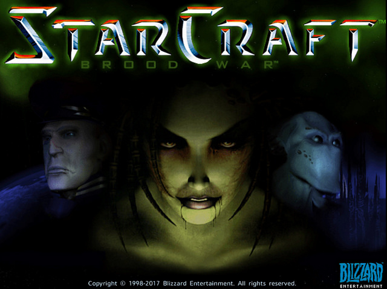

# Здравствуйте‼️🙋🏻‍♂️ Меня зовут Ким Джэ-Ук 

### Аналитик данных в Москве

> [!NOTE]
> Я начал вести GitHub совсем недавно, поэтому проектов здесь пока немного. Постепенно выкладываю почти всё, над чем работал. Нужно время, чтобы загружить

 

## 🧑‍💻 &nbsp; О себе

- 🎓 Закончил магистратуру «Науки о данных» в НИУ ВШЭ (06.2026)
- 🛡️ Проходил стажировку по информационной безопасности в SK Shieldus
- 📊 Анализирую данные и оформляю выводы в отчёты и презентации
- 🌏 Говорю свободно на корейском🇰🇷, русском🇷🇺, английском🇺🇸 и японском🇯🇵. 4 года учил французский🇫🇷 и 1 год классический латинский🏛️ в институте
- 🎮 В свободное время играю в RTS  и AOS-игры , смотрю киберспорт

 

## 🛠 &nbsp; Инструменты

**Анализ данных**

**Информационная безопасность**

 

## 📁 &nbsp; Что можно посмотреть

- [Портфолио](https://github.com/JWKIM-LOL/Kim-Jae-Wook) — проекты по анализу данных и кейсы для отбора в OZON
- [Сертификаты](https://github.com/JWKIM-LOL/Kim-Jae-Wook/tree/main/Сертификаты) — русский язык, математическая статистика, английский и японский языки

 

## 🎓 &nbsp; Образование

- $\textbf{\textsf{\textcolor{#0969DA}{Магистратура}}}$ «Науки о данных», $\textbf{\textsf{\textcolor{#0969DA}{НИУ ВШЭ}}}$, Москва — 09.2024 – 06.2026
- Подготовительный курс **русского языка** (онлайн) — НИУ ВШЭ, Нижний Новгород — 11.2023 – 06.2024
- Подготовительный курс **русского языка** — РГУ им. А.Н. Косыгина — 09.2023 – 06.2024
- Подготовительный курс **русского языка** — НИУ ВШЭ, Нижний Новгород — 02.2023 – 08.2023
- $\textbf{\textsf{\textcolor{#D1242F}{Магистратура}}}$, биостатистика и биоинформатика, $\textbf{\textsf{\textcolor{#D1242F}{Токийский университет}}}$ — 04.2021 – 03.2023
- $\textbf{\textsf{\textcolor{#D1242F}{Бакалавриат}}}$, экономика, $\textbf{\textsf{\textcolor{#D1242F}{Токийский университет}}}$ — 04.2014 – 03.2018 (GPA 3.79 / 4.0)
- ~~Бакалавриат, управление бизнесом, Университет Кукмин, Сеул~~ — 03.2011 – 02.2013 (не окончено)

 

## 📫 &nbsp; Контакты

 **Telegram** : [@moidrykk](https://t.me/moidrykk)

 **Почта** : v7rainbowapple7v@gmail.com
